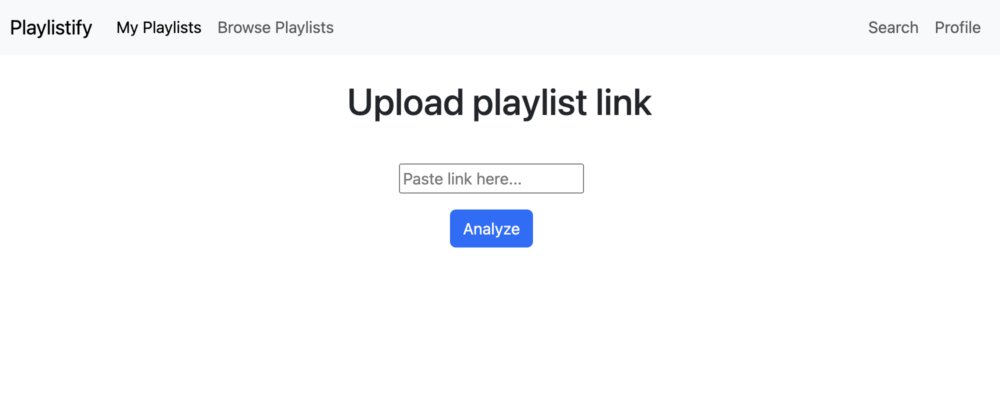
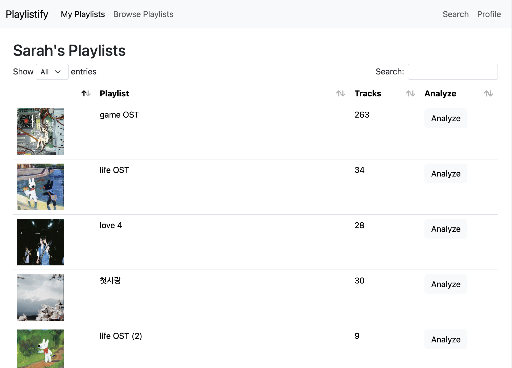
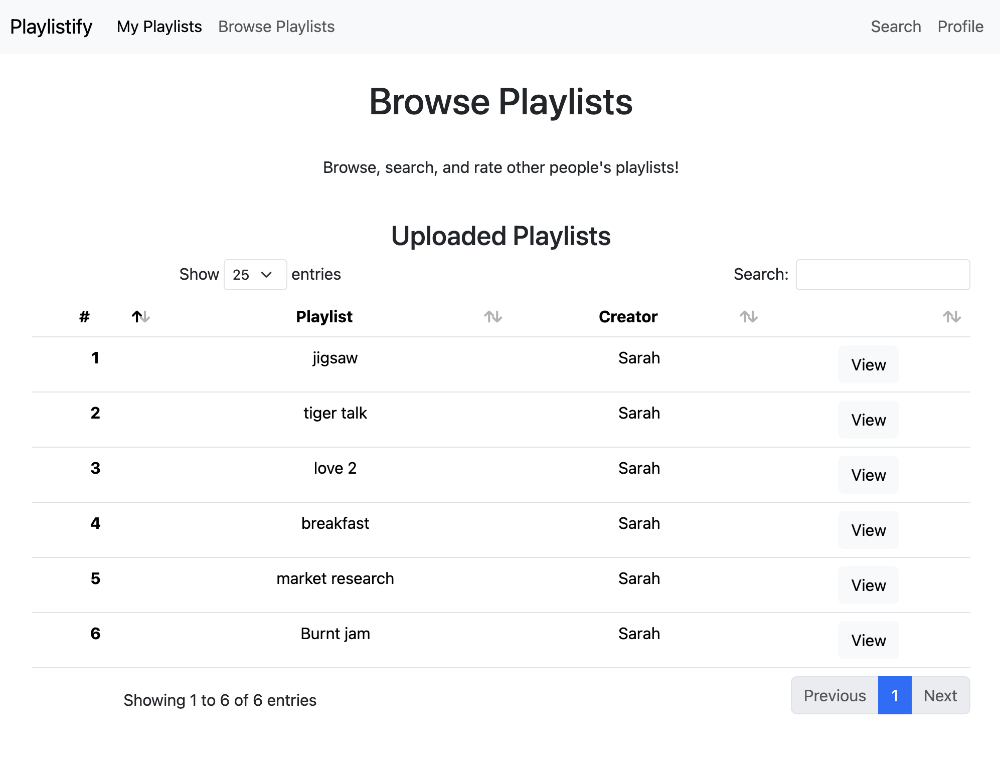
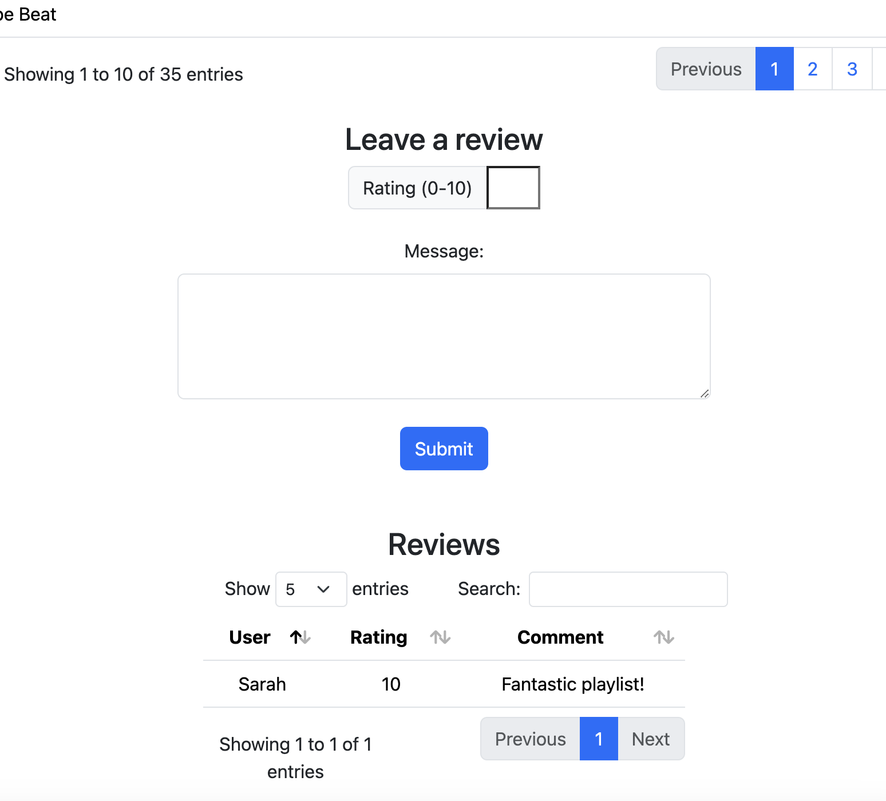
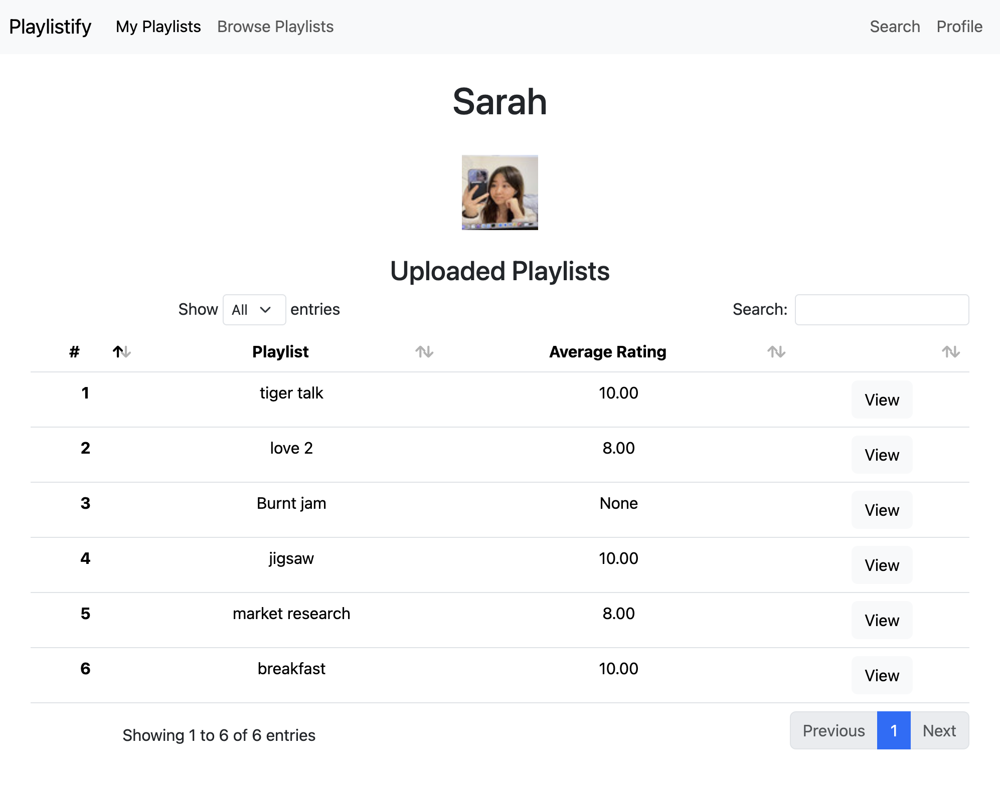

# Playlistify
Input a playlist link to see aggregate stats for the entire playlist! Playlistify helps you rate and leave comments on your friend's playlists, and discover new playlists.

### PostgreSQL information
- **Account:** ssh2198
- **Database Host:** 35.212.75.104
- **URL:** http://34.139.227.109:8111/


# App Description
My app implements all relevant database-related features. Below is a short description of each feature.

## Analyze playlists by pasting link
Anyone can simply paste a Spotify playlist link, regardless of owning a Spotify account or not.



## Fetch detailed analysis of songs in your Spotify playlist


After analysis, the following Spotify features are displayed for each song in the uploaded playlist:
- song_title
- song_id
- song_uri
- artists
- artist_uris
- popularity
- danceability
- energy
- key
- loudness
- mode
- speechiness
- acousticness
- instrumentalness
- liveness
- valence
- tempo
- duration_ms
- time_signature
- genres

In order to fetch playlist details for playlists already in the database, we save on API calls by creating a large composite query.

We get playlist information and a link to the owner's Spotify profile by querying an inner join on `Playlist` and `Users`.

```
SELECT p.playlist_id, p.title, p.image_url, p.description, u.user_id AS owner_id, u.name AS owner_name
            FROM playlist AS p
            INNER JOIN HasPlaylist AS hp ON p.playlist_id = hp.playlist_id
            INNER JOIN users AS u ON hp.user_id = u.user_id
            WHERE p.playlist_id = :playlist_id
```

For the contents of the data table, we reconstruct it by querying for all the composite features subattributes and inner join the artist information for each song.

```
SELECT song.song_id, song.title, song.popularity, 
                (song.features).danceability, (song.features).energy, (song.features).music_key, 
                (song.features).loudness, (song.features).music_mode, (song.features).speechiness, 
                (song.features).acousticness, (song.features).instrumentalness, 
                (song.features).liveness, (song.features).valence, (song.features).tempo, 
                (song.features).duration_ms, (song.features).time_signature, song.genres,
                array_agg(artist.name) AS artist_names
            FROM song
            INNER JOIN SongArtist ON song.song_id = SongArtist.song_id
            INNER JOIN artist ON SongArtist.artist_id = artist.artist_id
            WHERE song.song_id IN (
                SELECT song_id
                FROM PlaylistSong
                WHERE playlist_id = :playlist_id
            )
            GROUP BY song.song_id
```


## Easily analyze and post your created playlists
Login with Spotify to easily analyze any of your created playlists.


Users who login with Spotify can post their playlist to the database. 


A posted playlist inserts data into these tables (SQLalchemy code in `routes.py`):

- Playlist
- Users
- Song
- PlaylistSong
- Artist
- SongArtists
- PlaylistArtists

Note the constraint check: If the primary key already exists in the table, we don't add it. This way, duplicate playlists don't clog up the database.

## Browse playlists other people have uploaded
Posted playlists are all available to view in the website. Click 'view' on any given playlist to see.



See SQL logic to populate browse page in `browse` route in `routes.py`.

## Rate and comment on other people's uploaded playlists
While viewing anyone else's playlist, logged in users can rate other people's playlists from 0-10 and leave a review.



Populates the `Rate` table with a particular user rating and comment (optional).

## Interesting Query #1: View playlists you've posted and their ratings
Logged in users can see the playlists they've posted to the database, and the average ratings received on their playlist.



The way this list is populated is interesting. We check whether the user is logged in or not by checking the flask session. If logged in, we select for all playlists matching the user's `user_id` in the `HasPlaylist` table.

To get the average rate, we select for the average of `Rate.rating`, left join `Playlist` and `Rate`, and group by `playlist.title` and `playlist.id`.

```
SELECT playlist.title, playlist.playlist_id, AVG(rate.rating) AS avg_rating
            FROM HasPlaylist
            INNER JOIN playlist ON HasPlaylist.user_id = :user_id AND HasPlaylist.playlist_id = playlist.playlist_id
            LEFT JOIN rate ON playlist.playlist_id = rate.playlist_id
            GROUP BY playlist.title, playlist.playlist_id
```

I found this query interesting because of the grouping logic needed to combine the playlist and rate tables together, to return a meaningful average.

(Full code and SQLalchemy logic in `user_profile` route in `login.py`).

## Interesting Query #2: Search for specific playlists, songs, artists
Anyone can search for all playlists in our database. You can search for all playlist titles, songs, or artists containing a substring of your query.


Users can search for playlists containing a substring in three separate ways. Note that for all of these queries, we search for distinct playlist results, so playlists do not appear multiple times in the search results if multiple songs or artists within the playlist match the query. We also inner join the user name of the playlist creator, for displaying in the `view_playlist.html`. 

The three search methods are the following:

1. **Playlist title:** We select for distinct playlists containing a particular playlist title. 

```
SELECT DISTINCT Users.name, Playlist.playlist_id, Playlist.title
                    FROM HasPlaylist
                    INNER JOIN Users ON HasPlaylist.user_id = Users.user_id
                    INNER JOIN Playlist ON HasPlaylist.playlist_id = Playlist.playlist_id
                    WHERE Playlist.title iLIKE :query
```

2. **Artist name:** Select for all playlists containing a particular artist.

```
SELECT DISTINCT Users.name, Playlist.playlist_id, Playlist.title
                    FROM HasPlaylist
                    INNER JOIN Users ON HasPlaylist.user_id = Users.user_id
                    INNER JOIN Playlist ON HasPlaylist.playlist_id = Playlist.playlist_id
                    INNER JOIN PlaylistArtists ON Playlist.playlist_id = PlaylistArtists.playlist_id
                    INNER JOIN Artist ON PlaylistArtists.artist_id = Artist.artist_id
                    WHERE Artist.name iLIKE :query
```

3. **Song:** Select for all playlists containing a particular song.

```
SELECT DISTINCT Users.name, Playlist.playlist_id, Playlist.title
                    FROM HasPlaylist
                    INNER JOIN Users ON HasPlaylist.user_id = Users.user_id
                    INNER JOIN Playlist ON HasPlaylist.playlist_id = Playlist.playlist_id
                    INNER JOIN PlaylistSong ON Playlist.playlist_id = PlaylistSong.playlist_id
                    INNER JOIN Song ON PlaylistSong.song_id = Song.song_id
                    WHERE Song.title iLIKE :query
```

I found these queries interesting as well for their practical utility in making the database of playlists easier to search through and making the data feel more interactable.

(Full code and SQLalchemy logic in `search_results` route in `routes.py`).

## Unexpected challenges
It took a while to get Spotify authentication working, and implementing Oauth2, proper route callback, and session variable storing logic in order to get the app to work.

The app is still limited by Spotify because it is in development, so user login features are inaccessible unless your email is added to my list of approved users (up to 25) in the Spotify developer dashboard. Users can still analyze individual playlists and view playlists I've uploaded/ratings I've left.

## For the future
Due to time constraints, I chose to skip including these specific additional features I initially mentioned in Part 1:
- Graphical analyses
- AI summaries
- Recommendation/search algorithms 

These are not specifically related to database querying, so I felt it would be best to focus on implementing the backend framework for the purposes of this class project.

Perhaps these are features better implemented in Part 4, or outside of the scope of this class.